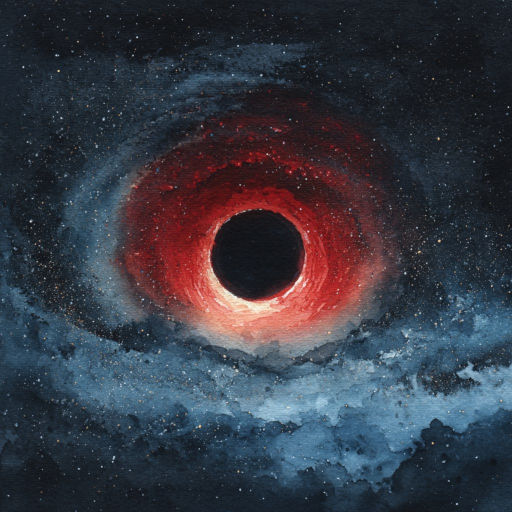
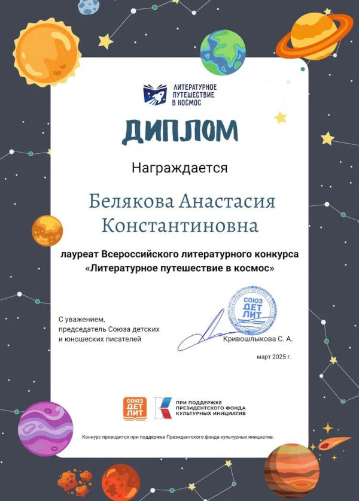

# Око звёзд

4 минуты
{ .md-time-to-read }

Солнце ещё издали заметил блеск Дома Скорпиона. Хозяин Дома ждал Светило на пороге с чашкой чая в клешнях. Солнце улыбнулся. Он может гордиться, что объединил такие разные Знаки Зодиака в Зодиакальный Круг и хранит его гармонию. А они должны благодарить его за милостивые визиты. Солнцу не хотелось думать о том, кто ждёт его после Скорпиона. О Змееносце, мнящем, что может стать тринадцатым в Зодиакальном Кругу, не имея Ока Звёзд. Но, разумеется, у этого ленивца ничего не выйдет.

\* \* \*
{ .center }

Змееносец стоял, заложив руки в карманы халата. Змея Клеопатра обвилась вокруг его шеи наподобие шарфа. Сегодня прекрасная Земля, всегда ласкавшая его взгляд нежной голубизной, не радовала глаз. Издали било золотое сияние -- через неделю Солнце будет на этом крыльце. А Ока Звёзд у Змееносца нет. Что же делать?..

Внезапно взгляд Змееносца привлекло иное свечение. Не Земля, не звёзды, не Солнце -- Комета, космическая странница.
{ #continue }

-- Подожди! -- он спрыгнул с крыльца. -- Ты избороздила всю Вселенную. Не слышала ли ты, где раздобыть тринадцатое Око Звёзд?

-- Нечто знакомое... -- Комета чуть замедлилась. -- Что за Око?

-- Это маленькое стёклышко, которое есть у каждого Знака Зодиака. Встав на пороге своего Дома и направив Око на Землю, они могут увидеть судьбы людей, рождённых под их Знаком. Этих стёклышек двенадцать, и никто из Знаков не может воспользоваться Оком Звёзд другого -- так они говорят.

Вдруг Комета рванула вперёд. Змееносец едва успел уцепиться за её хвост и вместе с ней понёсся прочь от Дома.

-- Было у Солнца Тринадцатое Око. -- нехотя проговорила Комета. -- Но тысячи лет назад он приказал мне тайком доставить это Око к Чёрной Дыре и бросить его во тьму.

-- Отнеси меня туда! -- воскликнул Змееносец.

-- В тот раз я там едва не погибла, -- холодно заметила Комета.

Тогда Змееносец поведал ей о своих печалях и заветной мечте -- присоединиться к Зодиакальному Кругу вопреки запрету Солнца.

-- Так и быть, помогу тебе, -- подумав, согласилась Комета.

-- Но из-з Чёрной Дыры-ы-ы не выбратьс-с-ся! -- шипение Клеопатры почти сливалось со свистом космического ветра.

-- В этом и заключается хитрость Солнца, -- пробормотал Змееносец.

...И вот они были на месте. Прямо перед ними вращалась чёрная воронка. Змееносец никогда не встречал такой жуткой черноты, затягивающей взгляд против воли. Вокруг воронки раскинулся белый ореол, который казался ярче света звёзд.

Комета дрожала. Замедлилось само время. Внезапно она, словно найдя новые силы, отчаянно рванулась в сторону, хвост хлестнул Змееносца по лицу и пропал вдали. Комета спаслась.

А Змееносец падал прямо в воронку. Мысли путались, растягивались и плющились. Мир ускользал от него. Он пересёк горизонт событий, скажут учёные Земли. Он пересёк границу всего.

\* \* \*
{ .center }

Кто он, где он, зачем он? В голове пусто, пусто вокруг. Змея. Откуда змея? И откуда это слово, может не змея вовсе...

Его тянуло в никуда, а он и не думал сопротивляться. Вокруг мелькало и кипело, живое и неживое, материя и ничто. А может, он сам ничто? Может притянуться внутрь себя, сжаться и пропасть? Никто не узнает. Даже Дева, которую он любил. А был и Овен. Он стриг Овна, а из шерсти сделал себе тапочки и халат. А ещё он искал Око Звёзд. Стёклышко...

Он представил его. Блестящее, в золотистой рамочке с рунами. Он увидел его перед собой -- в прямом смысле. Может, Чёрная Дыра не так уж и опасна? Она просто помогает найти то, что ищешь?

Вокруг стёклышка раскинулись переплетения ниточек прошлого, настоящего и будущего. Перед Змееносцем предстали моменты ушедших времён -- и тут он понял всё. Протянул руку и схватил Око Звёзд. Струны-ниточки оборвались, пропали видения.

Змееносец нёсся вперёд, но тянуло и назад. Вдали сияло нечто вроде Белой Дыры. Перед Змееносцем вытягивался сужающийся тоннель.

Вдруг Змееносца с неимоверной силой толкнуло вперёд, и он вылетел из пустоты. Мир поразил его своей необъятностью. Небо, звёзды, сияние... Так это же Солнце!

\* \* \*
{ .center }

Дева сжимала в руке своё Око Звёзд:

-- О Солнце, куда пропал Змееносец?

-- Он всегда был довольно непостоянным, -- цокнул копытом кентавр Стрелец.

-- Бе-езумие! -- Овен тряхнул головой.

Вдруг прямо к ногам Солнца, упал... Змееносец.

Он поднялся, откинул со лба чёрные волосы и показал Светилу на ладони стекло в золотой оправе:

-- Не ты обронил? Чёрная Дыра просила передать, что она не мусорное ведро!

И тут Солнце просто остолбенел...

-- Как ты узнал? Как нашёл Око? -- глухо проговорил он. -- Что ты натворил?!

-- В Чёрной Дыре, где сливается время и пространство, былое и грядущее, я увидел твой замысел. Все эти века ты обманывал Зодиакальный Круг.

Знаки зашумели, а Змееносец продолжал:

-- Ты тайно создал Тринадцатое Око и специально поместил его в Чёрную Дыру. В ней Око читает судьбы и тайны будущего людей Земли. А Двенадцать Очей двенадцати Знаков спутаны с ним. Ты начертил каждому путь, а люди слепо следуют судьбе, веря в астрологию.

-- Люди глупы! -- процедил Солнце. -- Конечно, я хотел контролировать их! Ты разрушил мой замысел, забрав Тринадцатое Око. Теперь ты понял, что невозможно стать Тринадцатым Знаком? Что ты будешь делать?

Клеопатра злобно зашипела на плече Змееносца, а тот спокойно ответил Солнцу:

-- Ты лишь одна из миллиардов звёзд, причём не самая крупная и яркая -- ты не имеешь права управлять людьми. Никто его не имеет. Я всё решил. Я уничтожу Тринадцатое Око Звёзд и освобожу людей. Пусть они поверят, что судьба в их руках, и никто не может её расписать по пунктам и прочертить, как маршрут. Люди забудут страхи и суеверия, вырвутся из твоей гравитационной ямы к иным звёздам!

И тихо добавил:

-- Я верю в людей.

*Май 2025 г., автору 13 лет.*

*Рассказ напечатан в журнале "Сценарии и репертуар" №12 (508), 2025 (Москва)*

***

*Это произведение награждено дипломом лауреата Всероссийского литературного конкурса "Литературное путешествие в космос", который проводил Союз детских и юношеских писателей.*

