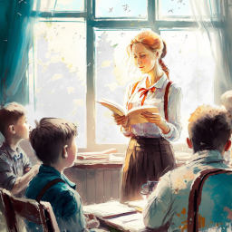
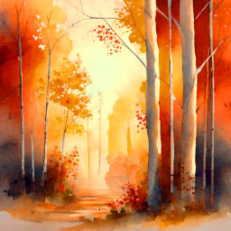

# Рассказы

В этом разделе вы увидите мои рассказы о дружбе, приключениях, природе, школе, доброте, праздниках, забавные и трогательные истории для детей и взрослых. Приятного чтения!

## Лето, в которое случилось это

Куда бежит бабушкин петух Петька? Что в таинственной посылке? Этот рассказ о приключениях городского мальчика Васи и его друга Вовки летом в деревне.

[:octicons-book-16: Читать](summer.md){ .md-button }

## Однажды, под нашим домом...

Кто знает, что скрывается под люком в каморке консьержей? Только Нина Белова и её приятель Серёга Малахов. Об их приключениях и говорится в этом рассказе.

[:octicons-book-16: Читать](under-our-house.md){ .md-button }

---

## Подарок

Кто не любит кошек? Ведь они такие мягкие, пушистые, они мурчат и приносят в дом умиротворение... А ещё они цветоводы, принцессы и просто обожают шалить! О проказах кошки Машки, жившей у моих родителей, читайте в этом рассказе.

[:octicons-book-16: Читать](present-mashka.md){ .md-button }

---

## Пробуждение от спячки

Под весенними лучами все согреваются и становятся добрее. В этом рассказе говорится о приходе тепла и пробуждении от зимнего сна.

[:octicons-book-16: Читать](awakening-from-hibernation.md){ .md-button }

---

## Подготовка к празднику

Подготовка к новогоднему празднику в школе -- дело нелёгкое. Это вам легко докажет Люся -- главная героиня этого рассказа.

[:octicons-book-16: Читать](preparation-for-festival.md){ .md-button }

---

## Добросовестные застройщики

Постройка дома даётся тяжело. Особенно, если ты с соседом по парте пропустила два урока технологии. Сражения с домом и трудности строительства -- в этом рассказе.

[:octicons-book-16: Читать](zastroyschiki.md){ .md-button }

---

## Жил да был Снеговик...

У всех есть свои мечты. Не только у людей, но и у снеговиков. Приключения Снеговика, мечтавшего путешествовать, описаны в этом произведении.

[:octicons-book-16: Читать](snowman.md){ .md-button }

---

## Как Петя заварил кашу

Петя вполне неплохой мальчик. Но вот манную кашу он совершенно не любит, как и некоторые из вас. И вот однажды он решает исправить кашу и берёт дело в свои руки. Чем же закончилось дело? Узнаете из этого произведения.

[:octicons-book-16: Читать](petya.md){ .md-button }

---

## Ласточкин папа

Маленькие птенчики такие милые и беззащитные. Порой помощь человека может быть им незаменима. О спасении птенца ласточки читайте в этом рассказе.

[:octicons-book-16: Читать](swallow-dad.md){ .md-button }

---

## Сосновые игрушки

Украшения для сосенок можно не только купить в магазине, но и сделать самому. О снежных шариках и написано в этом рассказе.

[:octicons-book-16: Читать](sosna.md){ .md-button }

---

## Подарок осени

Осенью природа становится ярче и удивительнее. О прогулке в тереме осени и маленьком подарке читайте в этом рассказе.

[:octicons-book-16: Читать](autumn-gift.md){ .md-button }

## Читайте также

<a href="../tales">
<figure>
<figcaption>Сказки</figcaption>
</figure></a>

<a href="../poems">
<figure>
<figcaption>Стихи</figcaption>
</figure></a>

<a href="../fanfics">
<figure>
<figcaption>Фанфики</figcaption>
</figure></a>

<a href="../riddles">
<figure>
<figcaption>Загадки</figcaption>
</figure></a>

