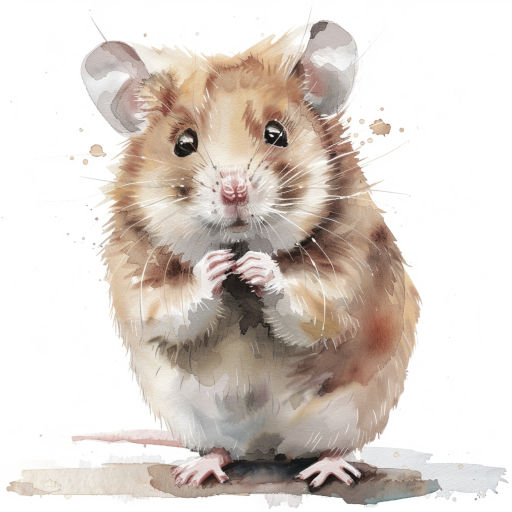
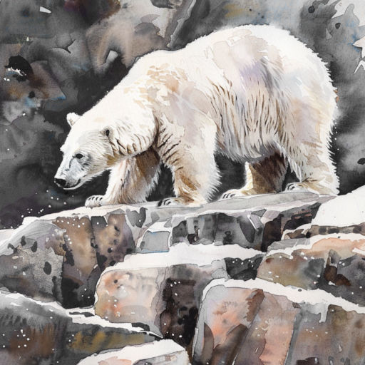

# Северное лето

12 минут
{ .md-time-to-read }

Ветер холодил щёки. Федя шёл по парковой аллее. Кругом никого. Так странно, ведь на фотографиях, которые он видел в интернете, здесь было полным-полно горожан. 

Федя так и называл жителей этого северного города. Он никак не мог запомнить, как правильно называются горожане Мурманска[^1]. То есть он даже не понимал, кем стал после переезда.

[^1]: Жители Мурманска -- мурманча́не, а в единственном числе их называют мурманча́нин или мурманча́нка. Кстати, Мурманск -- крупнейший в мире город, расположенный за Северным полярным кругом и один из крупнейших портов России. Порт находится на побережье Баренцева моря -- окраинного моря Северного Ледовитого океана. Несмотря на расположение, порт в Мурманске незамерзающий из-за тёплого течения, приходящего из Атлантического океана.

Вот раньше всё было ясно -- он москвич. И папа москвич. А мама москвичка. Теперь всё запуталось. И мама уже не с ними.

"Так будет лучше". Это папа часто говорил Феде с того дня, как они с мамой расстались. Но Федя не хотел этого "лучше". Пусть всё будет как есть, лишь бы родители оставались вместе! Пусть они часто ругаются, пусть папа редко бывает дома из-за работы...

Но нет. Сперва мама оставила их московскую квартирку, потом они с папой переехали на самый север России. Но "лучше" не стало. Перед переездом папа уверял, что в Мурманске очень красиво. Наверно. Но Феде казалось, что в Москве было в разы лучше.
{ #continue }

Задумавшись, он не заметил, как оказался на лестничной площадке. Открыв нижний замок, Федя вставил ключ в верхнюю скважину, но он упорно не желал поворачиваться. Похоже, папа дома.

Отец распахнул дверь. Со встрёпанными волосами, блестящими очками. Похоже, только пришёл из офиса. На его лице играла широкая улыбка, от которой Федя почти отвык.

-- Заходи, у меня прекрасные новости!

Федя закрыл за собой дверь. Его отец радостно сообщил:

-- Мне предложили участвовать в экспедиции на остров Чамп. Ты же понимаешь, это будет просто фантастическое событие для меня, как для геолога!

Таким сияющим Федя его давно не видел. Он смутно понимал, о каком острове идёт речь[^2]. Но боялся, что задав вопрос он сломает какую-то тонкую грань и папа станет таким, как в последние месяцы -- хмурым, молчаливым, резким. 

[^2]: Остров Чамп находится в Северном Ледовитом океане. Там нет постоянного населения и очень холодно. Даже в июле температура воздуха держится около нуля.

Едва Федя переобулся, отец позвал его в комнату. Открыв на своём рабочем ноутбуке карту мира, он указал пальцем на монитор. От его прикосновения на экране появился синеватый ореол, который мгновенно исчез. Федя прочитал: "Земля Франца-Иосифа". По горке островов словно змейки разбегались названия. А вот и белое пятнышко -- "о. Чамп".

-- Только на этом острове из всего архипелага находятся удивительные шарообразные камни! Вернее, никто точно не знает, камни ли это. И они совершенно разных размеров -- от пары сантиметров до нескольких метров в диаметре. Понимаешь, это древняя загадка для всего человечества[^3]! -- быстро рассказывал отец и вдруг посерьёзнел. -- Послушай. Я отправляюсь через неделю на ледоколе "Клин"[^4]. Это на месяц. Тебе придётся пожить одному в квартире. Я уже поговорил с соседкой Галиной Ивановной, она присмотрит за тобой.

[^3]: Существуют несколько теорий о происхождении загадочных круглых камней острова Чамп, но ни одна из них пока не подтверждена окончательно. Единственное в чём уверены ученые -- эти камни не вулканического происхождения. По одной из версий, камни образовались на морском дне, в толще осадочных пород. Затем, из-за какого-то катаклизма остров Чамп поднялся из глубин моря. Ветер и непогода постепенно разрушили отложения, и камни оказались на виду.

[^4]: На самом деле не существует ледокола с названием "Клин". Сейчас, в составе ледокольного флота России есть семь атомных ледоколов -- "Ямал", "50 лет Победы", "Таймыр", "Вайгач", "Арктика", "Сибирь" и "Урал". Первый в мире атомный ледокол "Ленин", спущенный на воду еще в 1957 году, уже не выходит в море и установлен на вечную стоянку рядом с морским вокзалом города Мурманска. Если будете в Мурманске -- посетите этот корабль-музей.

-- Но почему? -- резко возразил Федя. -- Почему я должен оставаться с чужим человеком, в незнакомом городе?

-- А как ты себе это представляешь? Что я возьму тебя с собой?

Папа подумал, вздохнул и добавил:

-- Если хочешь, я попробую договориться с тётей Олей, поживёшь у неё в Питере. Один билет на самолёт мы можем себе позволить. Я отвезу тебя в аэропорт, а когда прилетишь, тебя встретит тётя.

Федя любил самолёты и город на Неве, но только не тётю Олю[^5]. Голос мальчика задрожал:

[^5]: Тётя Оля жила на окраине Петербурга далеко от метро и обладала скверным властным характером. Поэтому, в гостях у неё Феде вряд ли удалось бы часто гулять по Невскому проспекту и любоваться красотами культурной столицы. Кроме того, тётя Оля пыталась сочинять стихи, а ежедневное обязательное прослушивание её "творений" явно не входило а Федины планы.

-- Но ты ведь сам всегда мне говорил, что мы должны держаться друг друга!

-- А ещё я говорил и говорю, что мужчины должны быть сильными, -- спокойно возразил отец. -- Будь ответственным, выбирай.

\* \* \*
{ .center }

Хомяк Киришка пищал в клетке. После переезда он один остался таким же, каким и был -- беспокойным, суетливым, но всё равно понимающим. Глядя в его глаза, похожие на блестящие бусинки, Федя чувствовал себя совершенно опустошённым. Мальчик не спал всю ночь, пытаясь что-то придумать. Но тщетно. От билета в Питер он решил отказаться, чтобы подольше побыть с папой.

Отец уже два дня не ходил в офис, хотя раньше работал и по выходным. Не ушёл и сегодня. Он бродил туда-сюда по квартире, окрылённый мыслями об экспедиции, собирал вещи в походный рюкзак. Проходя мимо иногда что-то спрашивал у Феди -- как с уроками, что по оценкам. Но эти вопросы звучали странно, словно "для галочки" -- ведь на дворе лето, а в школе каникулы. Разговор не клеился.

Если бы папа просто не пошёл на работу, Федя был бы счастлив. Сколько раз он представлял, что они будут делать вместе, куда пойдут, какой фильм посмотрят. Но сейчас... Федя не знал, что делать. Он пробовал перечить, но папа отмахивался от него, как от назойливой мухи.

Стоя на коленях возле клетки с Киришкой, Федя смотрел и смотрел на хомяка.

-- Мой ледокол в 17:30... -- твердил папа как заклинание.

Конечно, ледокол был не его. Федя не мог представить, что отец когда-нибудь настолько разбогатеет, чтобы владеть собственным ледоколом[^6].

[^6]: Постройка современного атомного ледокола проекта 22220 ("Арктика", "Сибирь" или "Урал") обходится примерно в 60 миллиардов рублей.

И вот протрезвонили три раза старенькие настенные часы. Они тоже остались прежними, как и хомячок. Только Киришка спешил, а часы, наоборот, немного отставали.

-- Эй, сынок.

Федя обернулся. Отец присел рядом и взглянул сыну в глаза.

-- Будь молодцом.

Федя вздрогнул. Так говорила мама. Это были её последние слова, которые она сказала прежде чем навсегда исчезнуть за дверью.

И отец тоже уходил.

Едва клацнул в замке ключ, Федя резко вскочил. Да, он обязательно будет сильным. И поэтому он не останется здесь.

Федя распахнул жалобно застонавший шкаф.

-- Прости, -- произнёс мальчик, словно шкаф мог его услышать.

Быстро одевшись, Федя схватил из ящика ключ и подошёл к двери. Киришка жалобно пискнул.

-- Послушай... -- серьёзно начал было Федя, но тут же осёкся.

"Чем я тогда лучше папы?" -- подумал он и вернулся в комнату.

-- Иди сюда, друг, -- он взял с тумбочки пакетик корма, раскрыл клетку и сунул хомяка за пазуху, а пакетик -- в карман ветровки. -- Что ж, пора на Север.

\* \* \*
{ .center }

Федя никогда не бегал так быстро. Напрямик, по лужам и газонам он нёсся к порту. Июльское небо пристально следило за его маленькой фигуркой среди безмолвных домов и дорог. Мелкий дождь неразборчиво бормотал в ветвях тополей на аллеях, но Федя его не слышал, вздымая брызги и не обращая внимания на испачканные брюки. Стояло короткое северное лето, и, несмотря на дождь, было довольно тепло. По лужам плыли мокрые хлопья тополиного пуха[^7].

[^7]: Несмотря на то, что Мурманск расположен за Северным полярным кругом, в июле воздух прогревается выше двадцати градусов, и тополя прекрасно себя чувствуют. Как и в более тёплых регионах, тополиный пух в июле укрывает улицы Мурманска "летним снегопадом".

Ещё издали завидев порт, Федя сбавил скорость. С трудом переводя дыхание, он спросил у случайного прохожего:

-- Подскажите, сколько времени?

-- Без десяти пять, -- отрывисто ответили ему.

До отправления оставалось совсем немного времени. Подбежав к причалу, Федя выдохнул. Ледокол стоял на месте, возле него туда-сюда сновали люди, что-то погружая. На борту расположилась краткая надпись "Клин". Это он.

Спрятавшись за горой огромных ящиков, Федя осторожно заглянул в один из них. Вот удача, пустой! Наверно, команда собралась погрузить туда один из загадочных камней для исследований на Большой земле. Федя забрался внутрь ящика и едва успел закрыть крышку. Вдруг он почувствовал, как поднимается вверх.

-- Ну и тяжеленная! Что они там везут? -- раздался хрипловатый голос грузчика.

-- Да какая разница, всё равно этих учёных не понять, -- отозвался второй.

Федя затаил дыхание, чувствуя как часто бьётся сердечко притихшего хомячка. Вот движение остановилось. Коробку с глухим толчком поставили на пол. Слушая отдаляющиеся шаги, Федя потихоньку приходил в себя. Он уже подумывал выбраться и осмотреться, как голоса снова вернулись.

-- Всё, это последняя. Скоро отплытие.

Отлично. Остаётся ждать.

\* \* \*
{ .center }

В темноте что-то мерно гудело. Федя больше не мог сидеть в своём укрытии. Шея затекла, всё ломило. Тихонько приподняв крышку, мальчик огляделся. Привыкнув к полумраку, он увидел очертания двери и тихонько направился к ней.

Ему открылся серый коридор и лестница наверх. Федя вздохнул, чувствуя урчание в животе. Он никогда не бывал на ледоколах и совершенно не представлял, где хранится провизия.

Внезапно его мысли прервали резкие шаги. На лестнице появился тёмный силуэт. Федя вздрогнул, шагнул назад, но было поздно.

-- Федя?!

-- Привет, пап... -- неловко проговорил мальчик.

\* \* \*
{ .center }

-- Послушайте, нам надо вернуться! -- в который раз воскликнул отец. -- Это же мой сын!

Федя стоял с поникшей головой, разглядывая забрызганные носы своих ботинок.

-- Вот именно, это ваш сын, -- спокойно согласился усатый начальник экспедиции. -- И это по вашей вине он очутился здесь как внеплановый участник.

-- Участник экспедиции?!

-- Вот именно. Мы ушли далеко от порта, на манёвр мы потратим много времени и ресурсов. Поэтому Фёдор становится ещё одним членом команды.

Мальчик поднял взгляд, его сердце взволнованно забилось.

 -- Неужели? -- отец буквально озвучил его мысли.

 -- Ужели, ужели. Идите. Тёплую одежду мы ему найдём.

Киришка весело фыркнул, выглянув из-за пазухи. Отец прерывисто вздохнул.

\* \* \*
{ .center }

Экспедиция продолжалась уже четыре дня. Четыре дня стонущего льда и слепящего солнца[^8]. Это удивительное солнце казалось совершенно не к месту, ненужным сейчас. Отец походил на грозовую тучу, в которой чудом сдерживаются дождь, град, молнии и гром. Бесконечный ослепительный полярный день мерк рядом с ним.

[^8]: Летом в Заполярье, Солнце может не заходить за горизонт несколько месяцев, кружа по небосводу. Это явление называется полярный день. Чем ближе к полюсу, тем длиннее полярный день. На самом полюсе он длится полгода. А зимой наступает полярная ночь, и солнце также подолгу не показывается.

Федя сидел в каюте, слушал как отец быстро клацает по клавишам ноутбука. Пару раз мальчик пытался подсмотреть, что делается на мониторе, но все эти попытки пресекались. А когда каюта пустовала, Федя просто глядел в иллюминатор. Он никогда раньше не видел ледяного моря, тем более в июле.

 -- Земля близко.

Голос отца звучал глуше обычного и сразу развеял все мысли. Федя обернулся. Геолог замер перед ним, стёкла его очков блестели. В этот момент он совсем не походил на самого себя. Он не был отцом. Он был только учёным.

Мальчик ничего не ответил, чувствуя себя потерянным. Федя не знал, идти ему со всеми или оставаться. 

-- Эй, Фёдор, -- это начальник экспедиции заглянул в каюту.

-- Да? -- тихо отозвался мальчик.

-- Идём с нами, тебе нечего делать на корабле, -- и он слегка улыбнулся.

Федя и не знал, что начальники могут улыбаться. Но лучше бы ему улыбнулся отец.

\* \* \*
{ .center }

Когда учёные уходили, Федя оставался в лагере. Все всегда были чем-то заняты. Мальчику нечего было делать -- он ничего не смыслил в жизни Севера. Поэтому, как появлялась возможность, он ускользал.

Солнце, нещадно светившее во время пути, надолго скрылось за тяжёлыми, почти неподвижными тучами. Остров казался молчаливым и задумчивым. Наверно, потому что многие люди снаряжаются в экспедиции, исследуют его. Но всё равно не понимают. Даже острову порой нужно, чтобы его понимали.

Лагерь стоял на берегу, окружённый острыми скалами[^9]. Но не скалы удивляли Федю. А те самые круглые валуны, ради которых и затеялась сама экспедиция. Среди них мало было целых, многие гиганты лежали расколотые на части. Федя не мог представить, какая нужна сила, чтобы расколоть их. Хотя отец и говорил с другими учёными про лёгкий песчаник и хрупкое органическое ядро. 

[^9]: Остров Чамп круглый год покрыт ледниками. Но, в юго-западной части острова есть обширная территория, свободная ото льда.

Учёные работали неподалёку. Федя не хотел попадаться им на глаза и каждый раз уходил от лагеря всё дальше и дальше. В один день, вернувшись со своей прогулки, он застал геологов в лагере. По глубоким следам озабоченных морщин на их лицах и тяжёлому дыханию мальчик сразу понял -- что-то неладно.

-- Где ты был? -- едва завидев его спросил отец.

Федя не успел ответить. Отец жёстко продолжил:

-- Мы видели на берегу крупного белого медведя. Слава Богу, всё обошлось. Но медведи явно почувствовали присутствие на острове человека. Ты понимаешь, к чему могут привести твои прогулки?

Федя промолчал.

-- Никогда, слышишь, ни-ког-да не покидай лагеря. Ты меня понял?

-- Так если приходится скрываться, обороняться, спорить друг с другом, может эти камни того и не стоят? -- не выдержал Федя.

-- Послушай, ты вообще не должен был быть здесь! -- вспылил отец. -- Это из-за тебя нам пришлось возвратиться в лагерь. Я же знаю, у тебя нет никаких правил и принципов!

-- Прямо как у тебя, -- тихо и твёрдо возразил Федя.

Отец тяжело выдохнул и цепко взглянул на него.

-- Так может быть научишь меня, каким должен быть настоящий мужчина?

Федя не ответил. Ему не хватило духу на очередную резкую фразу и он просто опустил взгляд, как когда отец убеждал начальника экспедиции вернуться назад.

-- Присмотрите за ним, -- сказал отец единственному в лагере повару и ушёл вместе с другими учёными, взяв оружие.

\* \* \*
{ .center }

Несмотря на все слова отца Федя часто покидал лагерь. Повар был не только поваром -- он всегда был при делах, ему было не до мальчика. И благодаря этому Федя убегал и долго ходил по берегу среди шаров, которые по-прежнему необъяснимо притягивали его.

Мальчик не понимал, почему всем так важны эти круглые камни совершенно разных размеров. Он стоял на макушке невысокого валуна и кидал маленькие камешки в воду.

Чамп-чамп. А может этот остров назвали вовсе не в честь руководителя спасательной экспедиции[^10]? Может, это просто звук мерно падающих в воду камешков, над которыми все ломают голову?

[^10]: В 1903 году к северному полюсу отправилась полярная экспедиция под руководством Энтони Фиала. Из-за кораблекрушения, экспедиция не добралась до полюса, а её участники на два года оказались изолированы на Земле Франца-Иосифа. Федя знал, что остров Чамп назван в честь Уильяма Чампа, руководившего спасательной командой, которой в 1905 году удалось разыскать и эвакуировать полярников.

Вдруг Федя увидел дальше по берегу группу геологов. Среди них он сразу узнал рослую фигуру отца. В мальчике проснулось любопытство, он захотел хоть одним глазком посмотреть, что же они делают. Федя осторожно направился к учёным, укрываясь за камнями.

Внезапно он заметил силуэт, пробирающийся к геологам с подветренной стороны. Мальчик ускорил шаг, приближаясь к учёным. И тут Федя ясно понял -- это медведь.

Сердце мальчика часто забилось, как бились в ладонях бабочки, которых он ловил в Москве. Сама фигура зверя уже вселяла страх -- низко опущенная голова, внушительный размер, взъерошенная шерсть... Федя знал, что ни в коем случае нельзя шуметь. Но как тогда предупредить геологов и папу?

Мальчик совсем забыл про Киришку. Хомяк тут же выскользнул из-за пазухи тёплой куртки, которая была велика[^11].

[^11]: Как вы помните, Федя убежал из дома в обычной городской одежде, и начальнику экспедиции пришлось выделить ему снаряжение из запасов. Разумеется, вся одежда была рассчитана на взрослых полярников, и даже самая маленькая куртка была очень велика Феде. Чем и воспользовался шустрый хомячок. Во время прогулок, хомячок обычно грелся во внутреннем кармане куртки, а заботливый Федя аккуратно пресекал попытки бегства. Но увидев медведя, Федя растерялся и не уследил за любимцем.

-- Эй, ты куда? -- прошептал Федя, но было поздно ловить любимца.

Хомячок пробежал мимо геологов. Отец отвлёкся от работы и сразу же его узнал:

-- Киришка...

-- Тихо, папа, -- Федя решился и выбежал из-за камня. -- Медведь!

Геологи переглянулись. На этот раз у них не было с собой оружия. 

Медведь не отводил от них взгляда. Федя посмотрел прямо в тёмные глаза зверя и, вздрогнув, попытался укрыться за камнем. Не раскрывая пасти, медведь издал рык, пробирающий до мурашек. Тяжело втягивая блестящим чёрным носом воздух, зверь готовился к смертоносному прыжку.

Ничего не подозревающий хомячок побежал прямо под лапы зверю, петляя между камней. И вдруг медведь замедлил шаг, услышав писк Киришки. Он не мог увидеть хомячка, но точно почувствовал его присутствие. Зверь беспокойно замотал головой. Рык сменился шипением[^12].

[^12]: Белые медведи могут шипеть -- совсем как кошки. Шипение может означать, что медведь насторожен или нервничает.

-- Медведю неприятен писк грызуна, он замешкался. Уходим, -- негромко призвал отец, сжимая плечи сына. 

Хомячок потерялся из вида. Медведь по-прежнему беспокойно шипел.

-- А как же Киришка?.. -- возразил Федя.

-- Тихо, -- перебил его отец.

И они медленными шагами начали отступать всё дальше от медведя. 

-- Белые медведи плохо видят, но у них отличный нюх и слух, -- добавил отец, когда все отошли на безопасное расстояние. -- Медведь на пару секунд отвлекся на непривычный звук и запах. Это нас спасло. Но Киришку нам уже не разыскать среди этих камней.

Вдалеке раздался звук выстрела. Что-то случилось.

\* \* \*
{ .center }

Лагерь они застали полуразорённым.

-- Сюда приходили белые медведи, -- сообщил им повар. -- Они явно голодны. Я смог отпугнуть их сигнальной ракетой. Медведи успели не только разорить наши припасы, но и повредить часть аппаратуры. Теперь они так и повадятся к нам ходить. Прибрежного льда всё меньше, хищникам приходится оставлять привычные охотничьи угодья в океане и дольше оставаться на суше. Бескормица вынуждает искать пропитание рядом с людьми. Боюсь, что потом их уже не получится прогнать ракетницей.

-- Неужто экспедицию придётся завершить раньше времени?

Федя не слушал эти разговоры и молчал.

-- Сынок, -- тихо сказал ему отец. -- С Севером шутки плохи. Понимаешь, порой приходится терять, расставлять приоритеты -- так устроен мир. Но тебя я ни за что не потеряю. Это самое главное правило в моей жизни! 

-- Я плохой сын, плохой друг! -- Федя отвернулся, чтобы никто не увидел его слёз.

-- Вовсе нет! Если бы ты не уговорил нас с мамой тогда завести хомячка, если бы не проник на ледокол, возможно я бы погиб на этом острове. -- Федя вздрогнул. -- Ты не оставил Киришку дома и этим выручил всех нас, учёных.

-- Но Киришка ведь...

-- Киришка невольно спас нас. Это лучшее, что может сделать хомячок для своих хозяев. А лучшее, что могу сделать для тебя я -- извиниться за всё.

Федя крепко обнял отца и тот ответил ему тем же. По-настоящему и искренне. Впервые за всё это северное лето.

*Март 2024 г., автору 12 лет*
