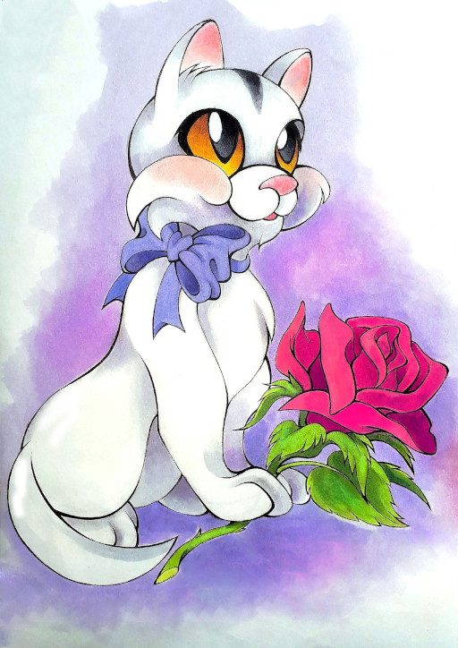

# Подарок

Эта история произошла ещё задолго до моего рождения…

***

Мой папа всегда очень любил кошек. И утверждал, что в каждом доме обязательно должна быть кошка. Ведь они очень ласковые, любят своих хозяев, их можно почесать за ушком и погладить им мягкий животик. А ещё они мурлычут и приносят умиротворение. Но мама не разрешала ему заводить кошку, говоря, что они больше приносят разрушений и хлопот, чем умиротворения. И папа часто вздыхал, словно Малыш из “Карлсона”, что “...вот так и проживёшь всю жизнь, без кота…”

И в один день мама сдалась и решила подарить папе на день рождения котёнка.

В папин день рождения мама отпросилась пораньше с работы, поехала к заводчикам и купила у них маленького двухмесячного котёнка. Кошечка была с большими жёлтыми глазами, с короткой шёрсткой и вся белая, только на макушке серенькая полосочка, будто кто-то мазнул кисточкой.
Мама приехала домой и накормила кошечку. Новый жилец сразу проявил своё любопытство и начал осваиваться в квартире. Услышав внезапный звонок в дверь (папа вернулся с работы), жилец со страху забился под диван. Папа очень обрадовался своему пушистому подарку, несмотря на то, что этот подарок пришлось полчаса вытаскивать из-под дивана.

Котёнка назвали Машка. Итак, Машка стала жить-поживать с моими родителями.

Мама и папа рано уходили на работу и поздно возвращались, а кошечка в их отсутствие активно исследовала мир и любила пошалить.

В Машке рано открылся талант цветовода. Она залезала на подоконник и обгрызала розы. И эти розы потом замечательно приживались в новых горшках, пышно цвели. На подоконнике благодаря Машке образовался настоящий розарий!

Кошечка была не только цветоводом, а ещё истинной принцессой и не любила нечистый лоточек. А родителей долго не было дома и потому она решила брать всё в свои лапы. Машка приспособила для своих нужд коробки из-под обуви, которые как Пизанская башня стояли за шкафом.

Проказничала она и в присутствии родителей.

Вот как-то раз мама стригла папу перед зеркалом в коридоре, а Машку закрыли в спальне, чтобы она не мешалась. Но кошка не признавала закрытых дверей, долго скреблась и мяукала. Наконец, ей удалось пробраться к родителям. Собрав на свою шкурку большую часть состриженных чёрных волос, она стала похожа на снежного барса. Самым быстрым способом вернуть Машке прежний вид, было её расчесать. И мама была в тот день семейным парикмахером.

А вдобавок ко всему Машка, как и папа, очень любила смотреть телевизор. Но только делала она это совсем по-другому! Кошечка забиралась на телевизор, свешивала мордочку и с интересом смотрела сверху вниз, стараясь поймать всё движущиеся лапкой. Ей очень нравилось это занятие, ведь при работе старый телевизор нагревался и на нём было очень уютно сидеть.

А по ночам, устав после дневных проказ, Машка любила лежать на подушке над маминой головой и урчать, словно маленький трактор, не давая спать.

Вот так хлопоты и заботы с непоседливой кошкой готовили родителей к моему появлению.

*19.01.2023 г., автору 11 лет.*

*Иллюстрация Елены Ревтовой для [публикации](https://vk.com/zhurnaliya?w=wall-199029891_14251) рассказа "Подарок" в детском журнале "Вверх тормашками".*

***

*Рассказ "Подарок" победил в конкурсе "Тайная жизнь наших питомцев", который проводила Тульская областная детская библиотека, и награжден дипломом.*

