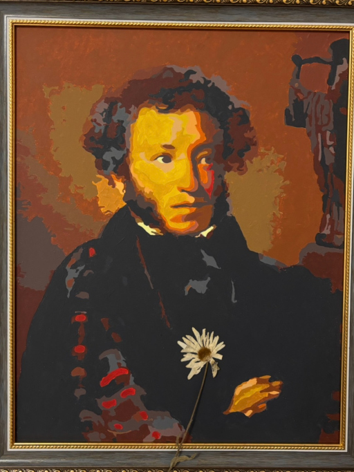

# Не нарисованное солнце

3 минуты
{ .md-time-to-read }

Эта история произошла совсем недавно. Как обычно я пришёл в школу и поднялся на второй этаж. У двери кабинета русского и литературы я обнаружил лужу.

Над головой протрещал звонок, подгоняя меня дальше по коридору к кабинету, где у меня должен был быть первый урок. Но вдруг из-за двери послышалось приглушённое всхлипывание.

Медленно я нажал на дверную ручку и зашёл в класс.

И увидел незнакомого кудрявого учителя.

И поразило меня даже не то, что он сидел на столе, и не ужасный бордовый шарф на его плечах, словно позаимствованный у бабули. А то что он, стиснув зубы, ныл, как первоклашка.

Он утирал слёзы каким-то листком с сочинением. Приглядевшись, я с ужасом увидел на нём свою фамилию.

И всё моё уважение к старшим мигом улетучилось.

-- Эй-эй, вы что! -- я кинулся вырывать у кудрявого пессимиста заветный листок. -- Я к этому сочинению все выходные готовился!

Незнакомец хмыкнул, сверкнув серыми глазами:

-- Неужели? А почему у тебя фамилия "Гринёв" через "е" написана?

-- Ну перепутал, -- я вырвал у него из рук листок с сочинением по "Капитанской дочке", перечёркнутый красным.

В длинных пальцах странный учитель вертел красную ручку.

-- Все десять раз перепутал? -- уточнил он.

Я хмуро промолчал.

-- Дальше, господин Б. Почему у тебя ни слова о том, что Маша отказалась выходить замуж за Петра?

-- Да вообще странный момент! -- возмутился я. -- Ей тут руку-ногу-сердце предлагают, а она драму устраивает!

-- Это самый важный момент! -- учитель в отчаянии схватился за голову. -- Это же образ чистой и искренней девушки, которая не желает быть причиной конфликта главного героя с родителями! -- он говорил так быстро и даже яростно, будто заучивал эти слова наизусть. -- И Пугачёва я, автор, сравнивал не с медведем, а с волком!

-- Зверь и зверь, -- буркнул я. -- Вы что, Пушкин?

Мой собеседник спрыгнул со стола. И оказался ниже меня.

-- А что, не похож? -- тихо, но отчётливо спросил он.

Только тут я глянул на стену, где висели портреты классиков. Гоголь с каре, Толстой, похожий на Деда Мороза... Рамка Пушкина пустовала.

-- Т-так... -- кажется, я вовсе забыл русский язык. -- Так это вы наши сочинения всё это время проверяли?

-- Не абсолютно всё, -- Пушкин был, похоже, доволен произведённым впечатлением.

И вдруг он начал читать стихи удивительным, бархатным голосом:

Учитель самых честный правил  
Когда не в шутку занемог,  
Всё непроверенным оставив,  
Я лучше выдумать не мог:  
Учителей постиг науку.  
Но, "чуваки", какая скука.  
Сидеть с листками день и ночь,  
Не отходя ни шагу прочь!  
Поймите: низкое коварство  
Учителям вас забавлять  
И молча двойки исправлять,  
Лукавству отвечать лукавством,  
Вздыхать и думать про себя:  
"Когда ж каникулы, друзья?"

-- Чуваки? -- за смешком я пытался скрыть шок. Сколько лет я смотрел на это "солнце русской поэзии" и мечтал увидеть его не нарисованное маслом, а вживую. Чтобы сказать всё, что я о нём думаю. Но язык не слушался никак. -- Где же вы таких слов набрались в девятнадцатом веке?

-- Господин Б., я провисел в этом кабинете двадцать лет! -- хмыкнул Александр Сергеевич, бродя по классу. -- И знаете, вы, дети -- не смотрите на меня так, вы ведь всё ещё дети! -- короче, не меняетесь вы. Те же ошибки.

Он с горечью кивнул на ворох сочинений на столе и продолжил:

-- Ладно, госпожа П., которая естественному интеллекту предпочла искусственный, или сударь Л., во всём полагающийся на свою соседку Н. Со стены, знаете ли, многое видно. Но вы-то, Б., наш человек, гуманитарий!

-- Потому что с математикой у меня совсем плохо... -- уныло протянул я.

-- Да слыхал я. Ты думаешь, что потолок такой мокрый? А это Пифагор в кабинете математики над нами "решенье чьё-то проверяет и тихо слёзы льёт рекой, опершись на руку щекой".

"А может, это просто крыша протекла?" -- подумалось мне.

А вслух я припомнил:

-- Так вы же сами двоечником были.

-- Я был гением, мне это простительно, -- Пушкин завязал свой клетчатый шарф и глянул на меня строго, как статуя.

-- Да уж, Марина Анатольевна вечно это твердит! Так что ваша самооценка в порядке! -- не выдержал я.

-- Ничего-то ты не понимаешь, господин Б., -- вздохнул гений. -- Она бьётся, как может, чтобы вы не только мемы читали. Чтобы вы *полюбили* читать. Вот даже голос сорвала, а вы? Неужели не жаль учителей?

Я молча вспоминал все рассуждения, литературные шутки и пламенные монологи нашей Марины Анатольевны. Никогда больше не назову её "русичкой".

-- А мы с Пифагором -- думаешь, такие токсики были, всю жизнь мечтали, как вы мучаться будете? Нет, господин Б. Писал я ночами, и думал порой: "Лишь бы потомкам стыдно не было". А тут за самих потомков кринжово. Реформируешь язык, выводишь теоремы -- а вам оно и не надо. Заметил, что Пифагор на своём портрете отвернулся? А всё потому что не учите ничего. Вот тоже отвернусь от вас. Может хоть мистику заметите и о чём-то задумаетесь.

-- Я... это...

-- Слово пацана? -- с полуслова понял меня А.С.

-- Слово чести, -- перебил его я.

Даже не верится, что между нами двести лет.

-- Ладно, иди, прогульщик. Скоро звонок. Марине Анатольевне ни слова, -- и Пушкин улыбнулся своей солнечной улыбкой.

Но вместо звонка зазвенел будильник. И я проснулся.

*24.04.2026 г., автору 14 лет.*

