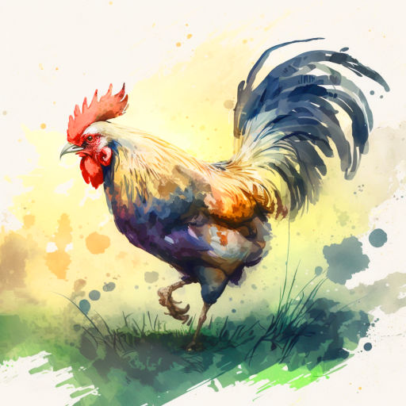

# Лето, в которое случилось это

Однажды летом Вася приехал в деревню, в гости к бабушке. Он помогал ей по хозяйству, приносил воды из колодца, пропалывал грядки.

Поначалу Васе было непривычно просыпаться ни свет ни заря от криков бабушкиного драчливого петуха Петьки. Но через недельку он привык, будто всю жизнь жил в деревне.

Как-то раз после обеда бабушка попросила Васю зайти на почту, чтобы забрать посылку и журнал "Мурзилка", который она любила почитать вечером в компании Васи.

Мальчик всё сделал, забрал и журнал, и посылку и уже возвращался домой. В большой коробке с посылкой что-то погромыхивало и Вася всё размышлял, что там такое.

-- Эй, Васёк! Куда идёшь?

Вася обернулся и увидел своего деревенского друга Вовку. Вовка был растрёпанный, штанина порвана, на щеке царапина. Оглядев своего приятеля, мальчик ответил:

-- С почты. Бабушка попросила зайти.

-- А я с окраины деревни, дикие яблоки собирал, -- он показал авоську, полную яблок. -- Кстати, а что там? -- Вова кивнул на посылку.

-- Не знаю, -- Вася пожал плечами.

-- Не знаешь? А вдруг... Вдруг там робот? Разумный, говорящий? Ты его принесёшь домой, а он вылезет из коробки и начнёт...

-- Что начнёт?

-- Что, что... Мир захватывать!

-- А тогда мы его выключим! Весь мир спасём, это какая слава будет! -- воскликнул Вася.

-- Э, брат! Не так просто! У него ж бластеры! Придётся сразится! Кия! -- и Вовка подпрыгнул, ударяя кулаком невидимого робота. -- Так, тихо! Кажется, пищит! -- он выхватил из рук друга коробку и поднёс к уху.

Вася тоже прислушался. Тишина. Но тут мальчики услышали шорох и опять писк откуда-то со стороны. Они повертели головой и увидели пищащий пушистый комочек в траве у дороги. Подойдя ближе и присев, Вася понял, что это котёнок. Рыжий, в лучах солнца он весь будто светился. Зелёные глаза чуть прищурены, смотрели они с интересом и искренним любопытством. Котёнку было где-то месяца два, наверное, он потерялся...

-- О! Котёнок! -- Вовка присел на корточки и начал подзывать котика. -- Кис-кис-кис...

Но котёнок только удивлённо посмотрел на него, шевеля маленькими ушками. И вдруг котик пулей сорвался с места и побежал в кусты по другую сторону дороги. Следом за ним нёсся петух, задрав пышный пёстрый хвост.

-- Куда! -- закричал Вася, вскакивая на ноги.

-- А что? Бежит и бежит, -- чуть удивился Вова.

-- Как что! Это же бабушкин петух Петька, самый лучший! Представляешь, как она расстроится!

-- Что ж мы сидим! Быстрее!

Вовка вскочил и мальчишки побежали следом за петухом и котёнком.

-- Петька! Куда ты?! -- кричал Васька, размахивая журналом.

-- Цып-цып-цып! -- горланил Вовка.

Но петух Петька не обращал на них внимания и всё нёсся, и нёсся вперёд.

-- Цып-цып! -- надрывался Вова.

И вдруг деревенский мальчишка почувствовал, что с его ноги соскочил кроссовок. Допрыгав до него, Вова спешно обулся и кинулся догонять приятеля.

-- Петька-аа! -- кричал Вася.

Высокая трава больно хлестала по рукам, лицу. Коряги, мелкие камушки будто специально прыгали под ноги, мешая бежать. Слева мелькала золотистая от солнца река: котёнок и петух бежали берегом. Справа темнел лес.

Петька начал забирать вправо.

-- Сейчас он в лес убежит! -- запаниковал Вася. -- Как там-то его искать будем?!

-- Успокойся! -- Вова на бегу стал вытряхивать яблоки из авоськи. Стукаясь и разбиваясь, они покатились к реке.

-- Ты чего? Ты же сам их собирал... -- Васька повернул голову и чуть не налетел на дерево.

-- Да ладно! Новых наберу. Держи, поймаешь петуха, ты ловчее.

Сунув журнал за пазуху, Вася схватил пустую авоську и припустил вперёд, утроив силы.

-- Э! Меня чуть подождёшь? -- крикнул ему вслед Вовка.

-- Да какое там подождёшь... -- прошептал мальчик.

Вот он, Петька... Распушив перья, задрав хвост, петух бежал и бежал, изредка воинственно горланя: "Уá уá уá-а-а!.." Васька чуть ли не наступал ему на лапы...

Расправив авоську, мальчик приготовился поймать петуха...

Но тут старая ива, склонившаяся к реке, словно подставила подножку. Вася споткнулся о толстый корень, покатился по склону, схватил кого-то авоськой и плюхнулся в воду у берега. Вынырнув, он отплёвывался и отфыркивался, тёр глаза краем рубашки. А его добыча огласила окрестности хрипловатым ором: "Уá уá уá-а-а!"

-- Петька... Петька! -- Вася был готов обнять петуха, но тот явно не разделял этой радости. Петька всё пытался клюнуть мальчика сквозь сетку.

Вася выбрался на берег с помощью подоспевшего Вовки.

-- Ну что? Ну что? -- спрашивал деревенский.

-- Вот, -- и Васька протянул ему авоську с петухом. Петька изловчился и клюнул Вову.

-- Ай! -- тот отскочил и погрозил петуху. -- Вот же птица!

-- Петушиный царь, Пётр Первый, -- с гордостью сообщил Вася, -- только что окна не рубит.

Мальчики засмеялись. Вовка выловил из речки журнал и вздохнул:

-- М-да.. Мурзилку не спасти...

-- Почему это? Вот же он! -- Вася, сжав петуха, показал на котёнка, спрятавшегося в зарослях.

-- Да я про журнал!

-- А что журнал? Новый купим! -- улыбнулся Вася, -- а Мурзилка -- это котёнка так зовут.

-- А что, похож! -- Вовка сравнил взглядом расплывшегося от влаги Мурзилку на обложке и Мурзилку на берегу. -- Точь-в-точь Мурзилка.

-- Мурзилка! -- позвал Вася котёнка.

Тот поднял головку и посмотрел на него.

-- Мурзилка! -- мальчик наклонился и положил руку ему на макушку. Котёнок чуть затрясся, но тут же успокоился, когда Вася стал гладить его. Тихонько замурчав, котёнок словно пытался произнести своё имя.

-- Ну ладно, я пойду... -- Вася поднялся и ещё крепче стиснул петуха.

-- Я с тобой. А то вдруг Петька ещё один марафон устроит, -- Вовка подмигнул.

Мурзилка мяукнул, напоминая о себе.

-- Стой, а как же он? -- Вася кивнул на котёнка.

-- На меня не рассчитывай. У нас и так два кота, и козы, и корова, и свиньи... Третьему коту родители точно не обрадуются.

Вася задумался:

"А я ведь всегда хотел котёнка..."

Ему вспомнилось, как он просил маму с папой купить котика. И как они отказывали, говоря что с котов лезет шерсть, что они дерут обои и приносят ещё массу разрушений...

Но Мурзилка выглядел таким маленьким и таким грустным, что Вася не мог просто взять и бросить его.

Петух клюнул мальчика, и тот очнулся от размышлений.

-- Вован, будь другом... Донесёшь Петьку?

-- Ну... Ладно... -- деревенский мальчуган взял петуха и спросил. -- А ты что?

-- А я Мурзилку понесу.

-- Так ты же говорил как-то, что тебе родители не разрешают кота заводить.

Вася ничего не ответил, только пожал плечами. Взяв у друга промокший журнал, сунул его под мышку и склонился над котёнком.

-- Мурзилка, -- котёнок поднял мордочку, -- пойдём домой.

Мурзилка встал. Вася взял котёнка на руки и два друга двинулись обратно. Выбравшись из зарослей на дорогу, они пошли к дому Васиной бабушки.

-- Попьёшь с нами чаю? -- предложил Вася. -- Бабушка сегодня пирожков напекла.

-- Хорошая идея. Только я домой сначала забегу, а то будут беспокоиться, что меня долго нет, -- согласился Вовка.

И вдруг он встал посреди дороги.

-- Что случилось? -- обеспокоился Вася.

-- Посылка... С роботом... -- проговорил его приятель. -- Где она?

-- Она... эм... Она вроде на дороге лежать осталась...

-- Бежим скорее!

Мальчики развернулись и со всех ног понеслись к тому месту, где последний раз видели таинственную коробку.

Прибежали. Остановившись, они отдышались. От быстрого бега даже закололо в боку.

-- Ну и где?.. -- тяжело дыша, Вовка огляделся.

-- Не знаю... -- ответил запыхавшийся Вася.

Петька снова заорал: "Уá уá уá-а-а!" Солнце клонилось к закату.

-- Уф... Домой уже надо... -- проговорил Вася.

-- Да какое домой! Робота надо искать! -- воскликнул его приятель. -- А то придёшь домой -- а дома-то и нету...

-- Ой! Как же там бабушка? Одна? Робот же! -- ахнул Вася.

-- А мои-то как? Маме страшно будет, папа же сегодня на сутках дежурит! -- охнул Вова.

-- Быстрей!

И они снова побежали к дому Васиной бабушки. Погоня за петухом отняла у них много сил, ноги болели. Но мысль об ужасном роботе подстёгивала их, и они бежали через силу.

Вот и Васин дом. Вовкин -- по соседству. В окнах золотится свет. Ребята пулей влетели в открытую дверь к Васе домой. Сидевшие за широким столом под окном подняли головы.

-- Бабушка! -- Вася кинулся вперёд.

-- Мам! -- Вовка обнял маму.

-- Что случилось? -- добродушно спросила Васина бабушка.

-- Ну в самом деле, сынок, что ты? Обнимаешь, будто сто лет не видел! -- улыбнулась Вовина мама.

-- А где робот? -- хором спросили мальчики, испуганно озираясь.

-- Какой робот! -- всплеснула руками Вовина мама.

-- Ну.. там, когда мы... -- запинался Вовка.

-- Ну посылка... Коробка... Подумали, там робот... -- проговорил Вася.

-- Ой, ну какой робот! -- засмеялась Васина бабушка. -- Это твои, Вася, родители, мне из города новое радио прислали! -- она указала на подоконник, где и впрямь стоял блестящий радиоприёмник. -- Я смотрю, нет тебя долго, пошла искать. Приметила посылку средь дороги, увидела, как вы с Вовой бежите к реке. Подумала, заигрались, о посылке-то и забыли. Ну я коробку и взяла домой. Тут твоя, Вов, мама зашла, сидим, ждём вас...

-- Уá уá уá-а-а!.. -- вдруг загорланил Петька из авоськи.

-- Ах да, Валентина Егоровна, мы тут это... -- начал Вова.

-- Петьку спасли! -- вставил Вася. -- Он чуть в лес не убежал.

-- Ай, молодцы! А я и не заметила, что Петя пропал! -- бабушка взяла авоську, отнесла петуха-бегуна в курятник и вернулась.

-- Чего ж это ваш петух бегает ни с того, ни с сего? -- удивилась Вовкина мама.

-- А это он за Мурзилкой, -- ответил Вася и поднял на руках рыжего котёнка. -- Журнал "Мурзилка" пострадал, пока мы гонялись за Петькой, зато другого Мурзилку принесли!

-- Ой, Вася, не знаю даже, что твои родители скажут... -- вздохнула бабушка.

-- А мы их с Васькой уговорим! -- воскликнул Вовка.

-- Ну а я вам помогу, -- улыбнулась старушка, -- а сейчас давайте чай пить! Аннушка, включи, пожалуйста, приёмник.

Они пили чай с пирожками, смотрели на закат над лесом, слушали мурчание Мурзилки и музыку из радиоприёмника. Оркестр играл симфонии Моцарта, а Петька -- великий бегун и просто драчливый петух, помогал, солируя из курятника:

-- Уá уá уá-а-а!

*05.02.2023 г., автору 11 лет.*

