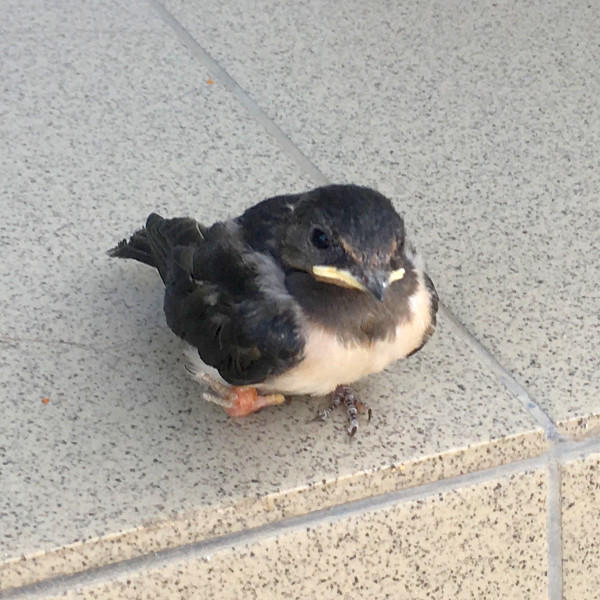

# Ласточкин папа

> История из жизни

Каждый год я с родителями езжу на море. И каждый раз там происходит что-нибудь интересное.  

В этом году мы второй раз подряд поехали в станицу Должанскую. Там мы увидели, как ласточки строят себе гнездо.  

Несколько дней я наблюдала за строительством. А потом мы на целый месяц уехали в другое место.  

Когда же мы вернулись в Должанскую, в ласточкином гнезде было два птенца: большой с жёлтым клювом и поменьше. 
 
Большая часть пищи, которую приносили родители-ласточки доставалась Желтоклюву. А маленький Кроха не доедал.  

Через неделю птенцы подросли и начали пробовать летать.  

В последний день перед отъездом я увидела, что Кроха сидит рядом с цветами, посажеными вокруг дорожки. Он сидел там несколько часов неподвижно. И тогда я поняла, что его надо спасать.  

Подошли мои родители, и мы стали думать, как помочь птенцу. А родители Крохи порхали над нашими головами и тревожно кричали.  

Мы решили посадить птенчика обратно в гнездо. Это ответственное задание мы поручили папе, как самому высокому члену семьи.  

Чтобы на крохе не остался человеческий запах, папа надел резиновые перчатки. Он взял птенца обеими руками, встал на табуретку и посадил Кроху в гнездо.  

В тот день я каждую минуту подходила к гнезду и смотрела, как там Кроха. Родители-ласточки успокоились, стали снова кормить птенца. Жизнь Крохи вошла в старое русло.  

А мама в шутку сказала папе:  

-- Ну вот, теперь у тебя появился ещё один ребенок!  

Папа обиделся на эти слова.  

А я подумала:  

"Мой папа -- герой!".  

И, хихикнув, прошептала:  

-- Настоящий ласточкин папа!

*2020 г.*

