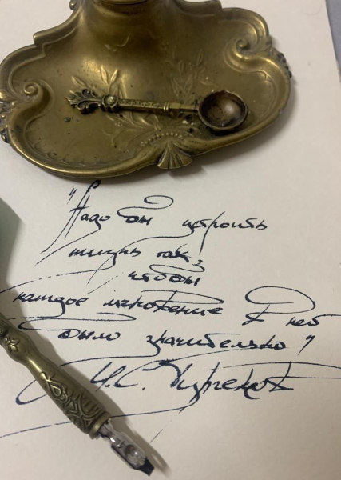

# Тургеневские острова

2 минуты
{ .md-time-to-read }

А вы знали, что великий классик русской литературы Иван Сергеевич Тургенев имел в своем распоряжении острова и был королём на одном из них?

В детстве, вместе с двумя своими братьями -- старшим Николаем и младшим Сергеем -- Иван Сергеевич любил играть в разные игры. И самой любимой была игра в острова. Как вспоминает сам писатель:

> "Нас было трое братьев. Из них у меня и у старшего брата было воображение довольно сильное, у младшего меньше. У нас существовала, как сейчас помню, игра. Был целый архипелаг островов. Я даже помню имена. У каждого из нас было по острову. Я был королём на одном из них, другой брат -- великим герцогом и прочее. Острова вели между собою войны. Происходили битвы, одерживались победы. Раз мне пришлось, помню, писать историю островов и я написал вот такую толстую тетрадь. Когда я начал читать её братьям, то в тех местах, где я дополнял историю воображением, братья меня останавливали: "Нет, нет, не так!" Затем я должен был нанести эти острова на карту и до сих пор помню форму этих островов. После я не раз спрашивал брата, кто сочинил эту игру, этих королей и прочее. Он не знал. Сам я тоже не знал, кому это пришло в голову. Точно всё это с неба свалилось готовым, как предание, создалось помимо нашей воли".

Сами братья дружили, хотя часто задирали друг друга. Шутки Ивана Сергеевича, остроумные и забавные, никогда не были слишком обидными. А в шутках Николая напротив, проступала колкость и раздражённость. Отличались братья и своей внешностью. Николай более походил на отца, Иван -- на мать, Сергей же, кажется, от родителей ничего не унаследовал. В характерах детей и вовсе вышла путаница. Иван был слишком мягок, уступчив и уклончив, не перечил родителям. Николай же, резкий и порывистый, говорил громко, скоро, увлечённо, в спорах не любил ставить себя вторым; привычка первенствовать укрепилась в нём с детства. Он был силён и ловок: в детских потасовках доставалось больше всех Ивану и Сергею. 

Но несмотря на такие различия, братья любили друг друга и любили играть вместе. А Иван Сергеевич не только играл, но уже в юном возрасте проявлял интерес к писательству.

Ушли времена, люди -- игра забылась, но Тургеневские острова существуют и в наши дни! 

При строительстве Куйбышевской гидроэлектростанции (ГЭС) возникла большая зона подтопления. В эту зону попало и село Тургенево Ульяновской области, названное в честь дальних предков писателя из рода Тургеневых. В 1956 году, при наполнении Куйбышевского водохранилища, образовался целый архипелаг живописных песчаных островов, изрезанных бухточками. Возможно таких, как представляли в своей игре Иван Сергеевич с братьями. Острова назвали Тургеневскими -- в память о селе, которое находилось неподалеку.

Минприроды РФ считает Тургеневские острова важной территорией с точки зрения сохранения уникальных природных ландшафтов, экологических систем и биологического разнообразия Ульяновской области. В данный момент находится на рассмотрении вопрос о придании Тургеневским островам статуса особо охраняемых территорий России.

Вот так Иван Сергеевич Тургенев случайно связал воедино несколько столетий.

*13.04.2023 г., автору 11 лет*

---

На основе этого очерка школьная телестудия выпустила сюжет "Тургеневские острова" с моим участием:

<iframe width="560" height="315" src="https://www.youtube.com/embed/fWgH-28a7Mw?si=LVyuiWrJGYkXVQdD" title="YouTube video player" frameborder="0" allow="accelerometer; autoplay; clipboard-write; encrypted-media; gyroscope; picture-in-picture; web-share" allowfullscreen></iframe>
