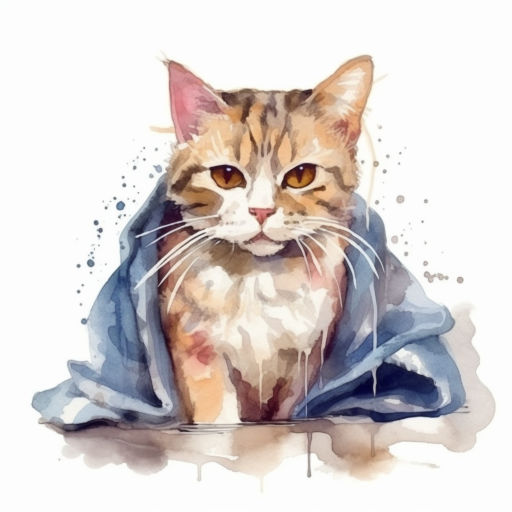

# Киты и коты

4 минуты
{ .md-time-to-read }

> К 105-летию со дня рождения Бориса Заходера. По мотивам его стихотворения "Кит и кот".

Казалось бы, только всё уладили, киты и коты стали жить как надо, как начались новые приключения. А дело было так...

***

Новая тетрадь с дополнительными заданиями по русскому языку уныло лежала на столе, раскрытая на одном из первых разворотов. Вася постукивал ручкой, качаясь на стуле, и совершенно не думал о домашней работе. Он представлял, как будет проходить новую игру на приставке в компании кота Басика... Ручная крыса Маришка пищала и суетилась в своей клетке на полке, и именно она прервала его мысли. Вася нехотя глянул в тетрадь.

"Вставьте пропущенные гласные буквы, подходящие по смыслу" -- а дальше шли несколько предложений. Особо не вдумываясь, Вася быстро написал где "о", где "и" и захлопнул тетрадь.

-- Всё! Дело сделано! -- мальчишка спрыгнул со стула, вприпрыжку отправился в соседнюю комнату и включил телевизор. Шёл прямой эфир, новости.

-- Защитники китов преследуют китобойное судно! Китобойный промысел считается браконьерством -- киты охраняются законом!

Вася хотел было переключиться на приставку, но замер. На экране кит медленно подплыл к браконьерскому судну. За кадром послышались взволнованные голоса:

-- Что происходит?

-- Что такое?

И внезапно кит выпрыгнул из воды, подняв тучу брызг, и грохнулся на палубу. Он стал елозить туда, сюда, словно устраивался поудобнее. Судно накренилось и зачерпнуло воды.

-- Кит устроился на судне! Словно кот в коробке!

Вася оторопел. Может, это какой-то фантастический фильм? Но нет... В окошке с информацией светится "Новости", наверно, папа смотрел недавно, горит значок прямого эфира...

С корабля посыпалось что-то такое мелкое, что было не разобрать -- снимали очевидно с другого судна, судна защитников. Вася сделал звук погромче, поставил на максимум, и из телевизора донёсся крик:

-- Это крысы! Крысы первыми покидают тонущий корабль!

Кит медленно соскользнул с судна в воду. Корабль приподнялся над водой, волны перестали заливать палубу. Кит же бил плавниками, раскрыл рот, подхватывая многочисленных грызунов.

Внезапно с кухни послышался грохот, мяуканье и мамин возглас. Вася бросил пульт и помчался смотреть, что произошло.

Кот Басик запрыгнул в раковину и с наслаждением подставлял полосатую мордочку воде из крана. Брызги летели во все стороны, недомытая посуда на дне раковины громыхала. Басик выпрыгнул из воды, подняв очередной фонтан, и приземлился на пол, растопырив лапы.

Мама Васи пришла в себя:

-- Басик, что ты?! -- испуганно спросила она у кота и выключила воду.

Взяла его на руки, хотела вытереть. Басик рьяно сопротивлялся, бил хвостом и топорщил мокрую шерсть.

-- Ты что пришёл? -- мама глянула на Васю. Она явно была не в духе.

-- Я это... Русский сделал...

-- Вот и молодец, иди проверяй, что сделал!

-- Хорошо... -- и Вася побрёл к себе.

Снова взял тетрадь, раскрыл и начал читать:

"Киты очень любят сидеть в коробках".

-- Ничего себе! -- не удержался Вася от восклицания.

"Коты умеют сильно бить хвостом".

-- Это да... -- Вася прочитал следующее предложение.

"Иногда коты выбрасываются из воды, хоть она и является родной им средой".

-- Да коты вообще ненавидят воду! -- Вася потянулся за карандашом и начал зачёркивать неправильные буквы.

"Киты очень ловко охотятся на мышей и крыс", -- последнее неправильное предложение даже рассмешило его.

-- Так ведь... Кит в передаче как раз устраивался на палубе, как на лежанке, а потом ловил крыс... Басик выпрыгнул из воды и стучал хвостом... Неужели...

Из соседней комнаты донеслись испуганные крики. Похоже, кото-кит разбушевался... Ванну оглашал стук хвоста Басика -- мама очевидно пыталась привести его в порядок. Вася быстро принялся исправлять ошибки.

"Коты очень любят сидеть в коробках".

Крики стихли, стих и стук. Послышалось мирное мурчанье, шаги кота и вздох мамы – Басик похоже сменил гнев на милость и отправился на свою лежанку.

"Киты умеют сильно бить хвостом".

Донеслись всплески и чьи-то слова:

-- Кит уходит на дно!

"Иногда киты выбрасываются на берег из воды, хоть она и является родной им средой".

-- Пожелаем ему всего хорошего! Кит ушёл от браконьеров довольно смекалистым путём -- отвлёк кошачьими повадками! Такой вряд ли выбросится на берег из-за болезни, по нему видно, какой он крепкий и мощный!

"Коты очень ловко охотятся на мышей и крыс".

По полам что-то зашуршало и запищало. Крыса Маришка выбралась из плохо закрытой клетки. Вася в последний момент схватил её, как прибежал, топоча, кот.

-- Брысь, -- негромко сказал ему Вася, поднимая крысу над головой. -- Я и так знаю, ты ловко ловишь крыс. Раз кит справился, справишься и ты.

И Вася улыбнулся.

На следующий день шёл урок русского, к которому Вася и готовил задание.

-- Все справились с домашней работой? -- спросила учительница.

-- Да! -- нестройно ответил класс.

Вася поднял руку.

-- Что такое? -- учительница взглянула на него.

-- Маргарита Васильевна, а вот у меня такая история приключилась...

И он рассказал о произошедшем.

Учительница задумчиво вздохнула.

-- Вася, помни, всегда надо писать правильно. Велик и могуч русский язык!

*18.09.2023 г., автору 12 лет*

***

*Это произведение награждено дипломом за победу в конкурсе "Заходер и все-все-все", который проводила Тульская областная детская библиотека.*

